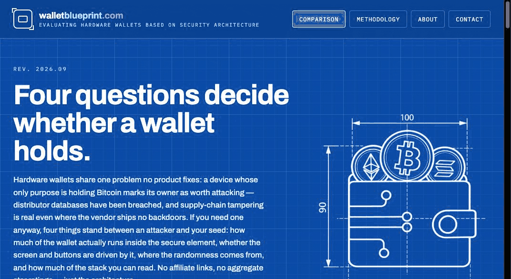

# walletblueprint

The source for **[walletblueprint.com](https://walletblueprint.com)** — an independent,
affiliate-free comparison of hardware wallets scored on **security architecture** rather than
features, coin counts or star ratings. 27 devices, four properties, one public rubric.

## Why it exists

Every system has bugs, and hardware wallets are no exception: a bug gets found, a firmware
update closes it, and that cycle is normal. An architectural flaw is different. If the seed
has to leave the secure chip to sign, or the screen is driven by a chip the host can reach,
no software release will fix that — it was decided in silicon and board layout the day the
product shipped.

Almost every hardware wallet comparison online is a shopping guide with an affiliate link at
the end. This one is a blueprint: it looks at how each device is built and says plainly
where it is strong and where you are being asked to take someone's word for it.

## The four properties

Each device is scored `0–10` on four architectural properties. Every score is the sum of
fixed components, not an impression, and each device's expanded row on the site shows the
arithmetic with a source against each part.

| Property | The question it answers | Where the points come from |
|---|---|---|
| **Secure element** | How much of the wallet actually runs inside it — authentication, key generation, signing, transaction building? | PIN or fingerprint limited by the element 2 · key generated in it 3 · transaction signed in it 3 · transaction built and hashed in it 2 |
| **Trusted I/O** | Are the display, the buttons and the host link driven by the element, or by a general-purpose chip beside it? | Display 4 and input 4 — driven by the element 4, by the device's own MCU 2, only in the phone app 0 · host link 2, earned only with no general-purpose chip in the path or no link at all |
| **Entropy** | Is the randomness from a certified generator, and can you contribute your own? | Source 5 — certified generator 5, uncertified hardware 3, software or undocumented 1 · number of sources 5 — several plus user entropy 5, several 3, one 1 |
| **Open source** | How much of the stack can you read and rebuild yourself, weighted by how close each layer sits to the seed? | Seed-touching firmware 4 · bootloader and other firmware 2 · board design 2 · host software 2 — each earns 100% if anyone could rebuild it to match the shipped binary with no closed libraries, 50% if it is only published, 0% if closed |

The composite is the unweighted mean of the four. It stays unweighted on purpose: the right
weighting *across* properties is your threat model, not ours. The components *within* each
property are weighted, because proximity to the seed is an architectural fact rather than a
preference.

The full rubric, with the reasoning behind each component, is on the
[methodology page](https://walletblueprint.com/methodology.html).

## How scores are sourced

Scores come from datasheets, published firmware, certification reports and disclosed attack
work. Every claim in a device's row links to the commit, datasheet page or disclosure it
rests on. Where a vendor claim cannot be checked, it is scored as absent rather than taken
on trust.

Scores are re-read when firmware ships, when a certification lapses, and when a disclosed
attack changes what a property is worth.

## Independence

- **No affiliate links.** Nothing here earns a commission, and no ranking is for sale.
- **Public rubric.** Every score maps to a written criterion you can argue with.
- **Sources named.** Every claim traces to a datasheet, a certification report or a disclosure.

## Corrections and suggestions

If a score looks wrong, a source has moved, or a device is missing, open an issue with the
link that supports the change, or email
[hossein@walletblueprint.com](mailto:hossein@walletblueprint.com). Every message is read by
a person, and submissions are never paid placements.

## License

Code is [MIT](LICENSE). The scores, notes, methodology text and diagrams are
[CC BY 4.0](https://creativecommons.org/licenses/by/4.0/) — quote and reuse them freely with a
credit and a link back to walletblueprint.com. Device photos belong to their manufacturers.
